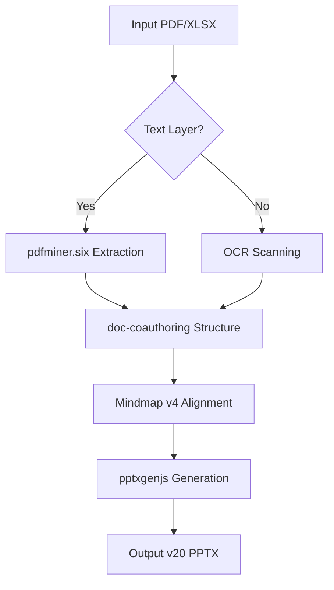
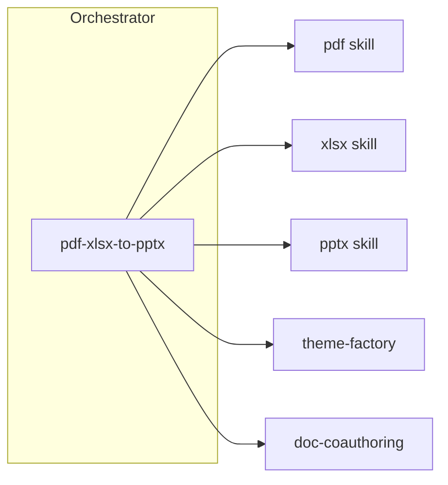

# PDF+XLSX → PPTX 專案技術規格書 (gemini.md)

## 1. 架構與選型
- **核心架構**：Orchestrator Pattern (以 `pdf-xlsx-to-pptx` 技能驅動子技能群)。
- **技術選型**：
    - PDF 解析：`pdfminer.six` (文字層) / `pytesseract` + `pdf2image` (OCR 掃描層)。
    - 生成引擎：`pptxgenjs` (Node.js)。
    - 設計基準：羅馬美學標準 (v20)。

## 2. 關鍵流程 (Mermaid)

## 3. 系統脈絡圖
- **輸入端**：`scratch/Skills_Workspace/Input/`。
- **處理端**：Antigravity Agent (使用組合技能)。
- **輸出端**：`scratch/Skills_Workspace/Output/`。

## 4. 模組關係圖

## 5. 專案現況
- **當前版本**：v21 (Marmoreal Integrity Edition)。
- **重點任務**：HRBP 角色重新設計 (AI 時代)。
- **特色**：所有頁面與心智圖 L4 (含頁碼) 強磁對齊，支援掃描件 OCR。
