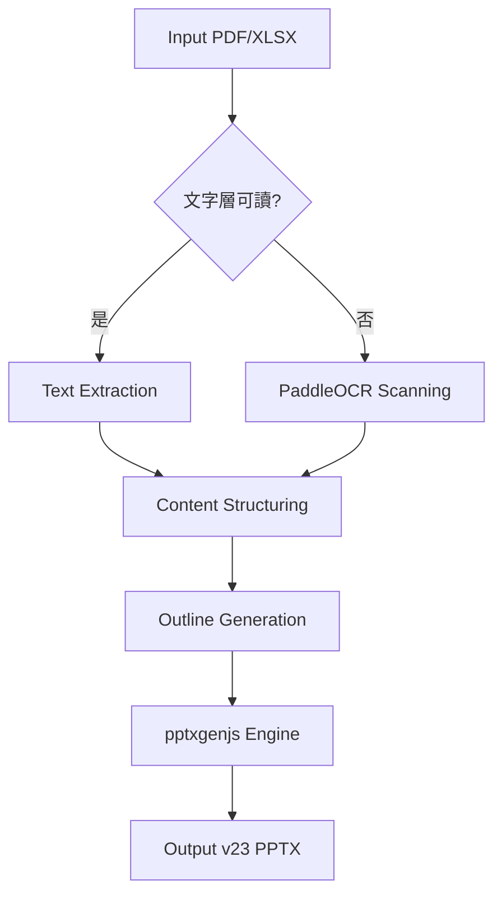

# PDF+XLSX → PPTX 系統規格書 (spec.md)

## 1. 架構與選型
- **核心架構**：Orchestrator Pattern (以 `pdf-xlsx-to-pptx` 技能驅動子技能群)。
- **技術選型**：
    - PDF 解析：`pdfminer.six` (文字層) / `paddleocr` (OCR 掃描層)。
    - 生成引擎：`pptxgenjs` (Node.js)。
    - 設計基準：羅馬美學標準 (v23)。

## 2. 關鍵流程 (Mermaid)

## 3. 資料模型
- **Input**: PDF/XLSX Binary
- **Intermediate**: `extracted_content.json` (Structured Text & Tables)
- **Output**: `.pptx` (Marmoreal Life Theme)

## 4. 關鍵類別與模組 (後端)
- `Extractor`: 負責各類檔案的內容擷取與清洗。
- `Orchestrator`: 串接各個技能模組的流程控管。
- `Renderer`: 負責 PPTX 的視覺渲染與排版。

## 5. 視覺標準 (羅馬美學 v23)
- 色彩：大理石紋理與古典金 (#F1F5F9, #B45309)。
- 字體：微軟正黑體 (Microsoft JhengHei) / Trajan (如適用)。
- 佈局：16:9 比例，動態非對稱佈局，嚴格遵循「零重疊」封閉系統。
- 插圖：擬真人誇張表情羅馬雕像 (Unique Across All Slides)。
